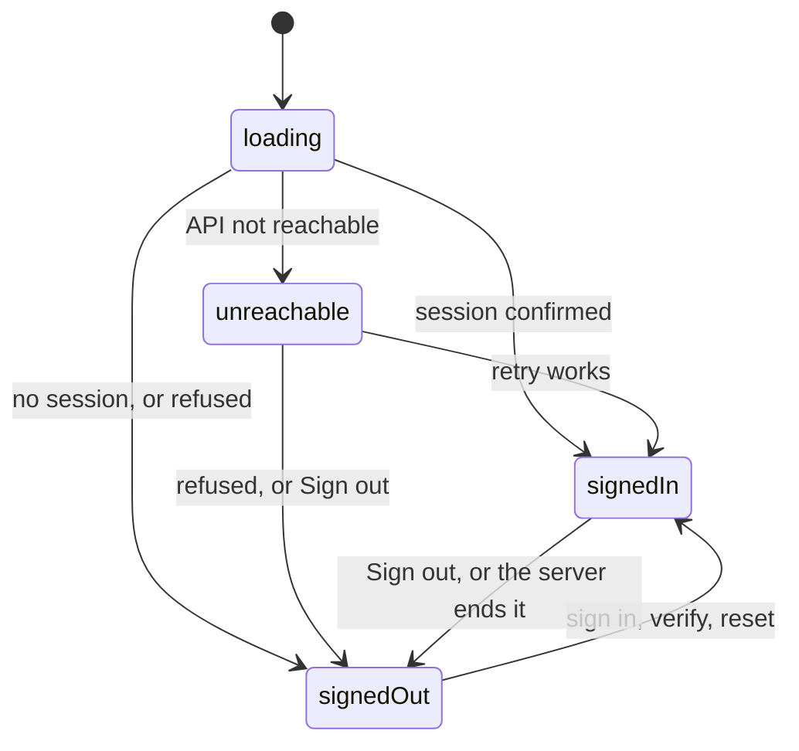

[Tasky mobile](../../README.md) › Auth

# Auth

How the app signs people in, keeps them signed in, and signs them out. v1 is email + password only; Google and Apple come later ([Platforms](../../../tasky-docs/design/clients/apps/05-platforms.md)).

## Contents

- [Flows](#flows)
- [Session status](#session-status)
- [Tokens](#tokens)
- [Error messages](#error-messages)
- [Where the code is](#where-the-code-is)
- [API endpoints](#api-endpoints)

## Flows

| Flow | When | Doc |
|---|---|---|
| Launch | Every app start: restore the saved session or show Sign in | [launch.md](launch.md) |
| Sign in | Email and password | [sign-in.md](sign-in.md) |
| Sign up | Create an account and verify the email with a 6-digit code | [sign-up.md](sign-up.md) |
| Password reset | Forgot password → code → new password | [password-reset.md](password-reset.md) |
| Tokens and invalid tokens | Renewing the access token; what happens on a `401` or when the server ends the session | [tokens.md](tokens.md) |
| Sign out | This device's session ends | [sign-out.md](sign-out.md) |

## Session status

One app-wide value in `useSessionStore` ([M13](../../../tasky-docs/design/clients/apps/06-mobile.md#decisions)). It decides which navigation group exists; only that group's screens can be reached.

| Status | Meaning | What shows |
|---|---|---|
| `loading` | The saved session is being checked | The splash screen |
| `signedOut` | No session | Sign in, Sign up, Password reset |
| `signedIn` | A confirmed session | The tabs, opening on Today |
| `unreachable` | A saved session the API can't confirm right now (offline, timeout, `5xx`) | Can't reach Tasky, with Try again and Sign out |

Changing status swaps the group: the old group's screens and their history go away. There are no redirects.

## Tokens

| | Access token | Refresh token |
|---|---|---|
| Used for | `Authorization: Bearer` on every signed-in request | Getting a new pair (`POST /auth/refresh`) |
| Lifetime | 15 minutes | 30 days from its last use, and never beyond 90 days after sign-in |
| Stored | Secure storage (Keychain / Keystore), key `tasky.tokens`, together with the refresh token and both expiry times ([M12](../../../tasky-docs/design/clients/apps/06-mobile.md#decisions)) | Same |
| Rotation | — | Every refresh returns a new one; using an old one ends the session |

Nothing else about the account is stored. `/me` and `/workspaces` are loaded after each sign-in and launch. The only other saved value is which workspace each user last chose on this device (AsyncStorage, not secret).

## Error messages

The app never shows the API's text. It maps the problem's `code` to `errors.<code>` in `src/shared/i18n/en.json` and `es.json` (`errorMessage()`), and shows a `400`'s field errors under the fields (`fieldErrors()`).

| Code | When | Message (English) |
|---|---|---|
| `auth.invalid_credentials` | Wrong email or password, or an account that was never verified | The email or password is incorrect. |
| `auth.account_deactivated` | The organization deactivated the account | This account has been deactivated. Contact your administrator. |
| `auth.account_setup_pending` | Right after verifying, before the account is ready (retried first) | Your account is still being set up. Try again in a moment. |
| `auth.invalid_code` | Wrong, used or expired 6-digit code | The code is wrong or has expired. Check the latest email or ask for a new code. |
| `network` | No response | Can't reach Tasky. Check your connection and try again. |
| `timeout` | No response within 15 seconds | Tasky is taking too long to answer. Try again. |
| anything else | — | Something went wrong. Try again. |

## Where the code is

| Piece | File |
|---|---|
| Session status, current user, workspace per user | `src/shared/session/sessionStore.ts` |
| Launch, sign in, sign out, retry (`useSession()`) | `src/shared/session/SessionProvider.tsx` |
| Tokens in memory and secure storage, refresh | `src/core/auth/tokens.ts` |
| Secure storage keys, what ends a session | `src/app/services.ts` |
| `401` → refresh → retry | `src/core/http/client.ts` |
| Auth endpoints | `src/data/identity/api.ts`, `types.ts` |
| Screens | `src/features/auth/` |
| Navigation groups | `src/app/navigation/RootNavigator.tsx` |

## API endpoints

All under `/api/v1/auth`, sent without an access token.

| Endpoint | Used by |
|---|---|
| `POST /register` | [Sign up](sign-up.md) |
| `POST /verify-email`, `POST /resend-verification` | [Sign up](sign-up.md) |
| `POST /login` | [Sign in](sign-in.md), and the last step of sign-up and reset |
| `POST /forgot-password`, `POST /validate-reset-code`, `POST /reset-password` | [Password reset](password-reset.md) |
| `POST /refresh` | [Tokens](tokens.md), [Launch](launch.md) |
| `POST /logout` | [Sign out](sign-out.md) |

The API side is in `tasky-api` (Identity module) and [access.md](../../../tasky-docs/design/access.md).
