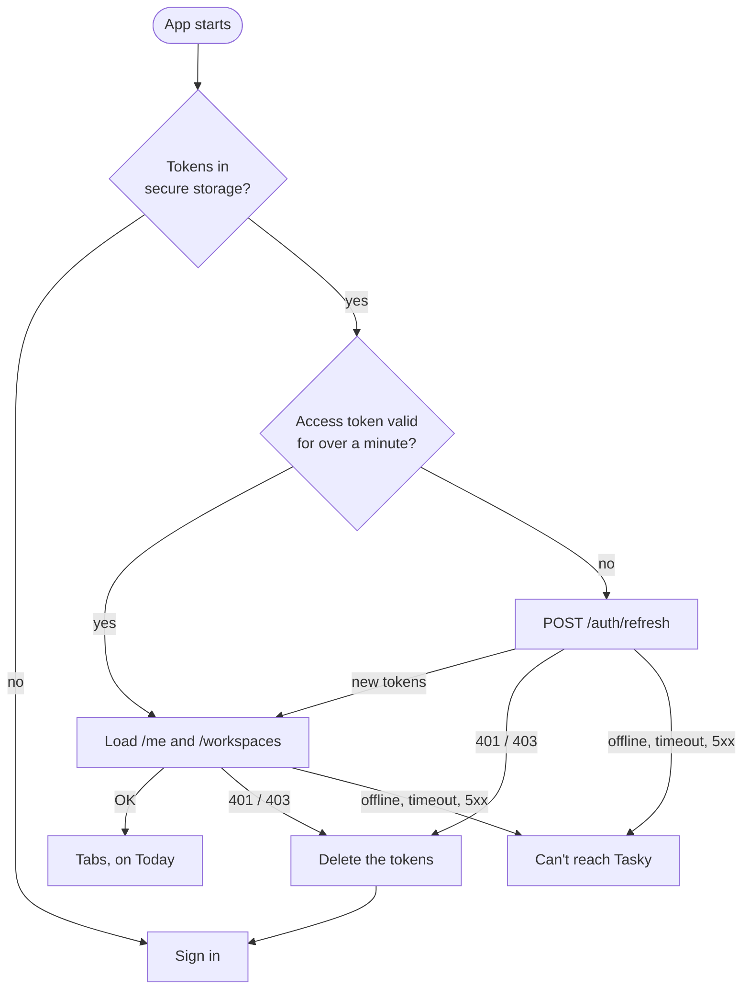

[Tasky mobile](../../README.md) › [Auth](README.md) › Launch

# Launch

On every start the app restores the saved session instead of asking to sign in again. Only the server refusing the session sends you to Sign in; a bad connection doesn't ([M12](../../../tasky-docs/design/clients/apps/06-mobile.md#decisions)).

## Contents

- [Steps](#steps)
- [Can't reach Tasky](#cant-reach-tasky)
- [Why the access token is saved](#why-the-access-token-is-saved)
- [Code](#code)

## Steps

The splash screen stays up until the fonts are loaded and the status is no longer `loading`.

1. **Read the tokens** from secure storage (`tasky.tokens`). None → status `signedOut` → Sign in.
2. **Get a valid access token.** A saved one that is still valid for over a minute is used as it is, with no network call. Otherwise the app refreshes first ([tokens.md](tokens.md)).
3. **Load the account:** `GET /me` and `GET /workspaces` in parallel, into the query cache. The profile's language is applied, and the user id goes into the session store (it picks the saved workspace).
4. **Show the app:** status `signedIn` → the tabs, which always open on the first tab, **Today**.

A refused refresh (`401`, `403`) deletes the tokens and shows Sign in. Any other failure, at any step, shows [Can't reach Tasky](#cant-reach-tasky) and keeps the tokens.

## Can't reach Tasky

Shown when there is a saved session but the API can't confirm it: no connection, a timeout, or a server error. Status `unreachable`.

| Action | Result |
|---|---|
| **Try again** | Runs the steps again from step 2. The button shows a spinner meanwhile |
| Coming back to the app | Tries again on its own |
| **Sign out** | [Signs out](sign-out.md) on this device, then Sign in |

Once the API answers, the app continues as above: the tabs, or Sign in if the session turned out to be over.

## Why the access token is saved

Every refresh gives a new refresh token and retires the old one. If an old one is ever used again, the API ends the whole session, because that's what a stolen token looks like.

Before M12 only the refresh token was saved, so every reload (including reloads while developing) had to refresh. A reload in the moment between the server issuing the new token and the app saving it left the app with the retired one, and the next launch ended the session. Saving the access token means a reload within its 15 minutes needs no refresh at all.

The small remaining risk, during the rare refresh itself, is a [pending decision](../../../tasky-docs/design/pending-decisions.md#apps): letting the API accept the token it just replaced for a few seconds.

Sessions saved before M12 (only `tasky.refreshToken`) are read once, refreshed and saved the new way.

## Code

| Step | Where |
|---|---|
| Launch, retry, foreground retry | `resume()` in `src/shared/session/SessionProvider.tsx` |
| Reading tokens, using or refreshing the access token | `accessToken()` in `src/core/auth/tokens.ts` |
| Secure storage, the old-key read | `tokenStore` in `src/app/services.ts` |
| Splash | `Root` in `src/app/App.tsx` |
| Can't reach Tasky | `src/features/auth/UnreachableScreen.tsx` |
| Which screens exist per status | `src/app/navigation/RootNavigator.tsx` |

---

↑ [Auth](README.md) · Next: [Sign in](sign-in.md) →
