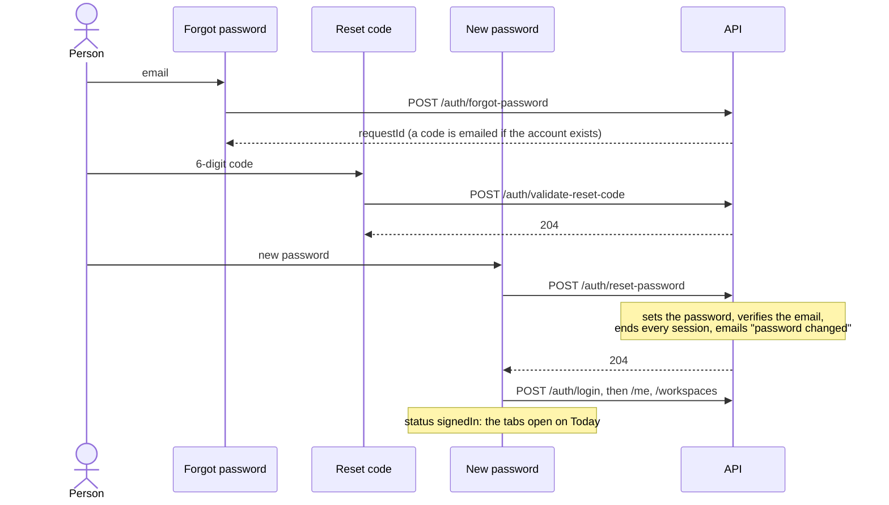

[Tasky mobile](../../README.md) › [Auth](README.md) › Password reset

# Password reset

Forgot password → a 6-digit code by email → a new password → signed in. Every other session of the account ends.

## Contents

- [Steps](#steps)
- [Screens](#screens)
- [Errors](#errors)
- [Code](#code)

## Steps

## Screens

**Reset your password**
- Opens from Sign in with the typed email filled in.
- **Send code** waits for a valid email. `POST /auth/forgot-password` answers the same whether or not the account exists, so the app always moves on.

**Check your email**
- The same code boxes as [Sign up](sign-up.md#check-your-email).
- `POST /auth/validate-reset-code` checks the code before asking for the new password, so a wrong code is caught here and not after typing a password.
- **Resend code** asks `forgot-password` again, which sends a new code and returns a new `requestId`.

**Choose a new password**
- The 8-character rule checks as you type, and **Save and sign in** waits for it.
- `POST /auth/reset-password` sets the password and ends **every session on every device**, including any other signed-in phone. It also marks the email verified, so this is also a way in for an account that never confirmed its sign-up code.
- Then the app [signs in](sign-in.md) with the new password.
- If the reset worked but signing in failed, the button only retries the sign-in (the code is single-use).

The email, `requestId` and checked code stay in memory only (`resetDraft`), never with the password. After a reload they're gone, and the screens go back.

## Errors

| Response | Where | The app |
|---|---|---|
| `400 auth.invalid_code` | Check your email | Under the code |
| `400 auth.invalid_code` | New password (the code expired meanwhile) | The button becomes **Get a new code**, back to Reset your password with the email filled in |
| `400` with field errors | New password | Under the field |
| No response | Any step | "Can't reach Tasky…" |

## Code

| Piece | Where |
|---|---|
| Screens | `src/features/auth/ForgotPasswordScreen.tsx`, `ResetCodeScreen.tsx`, `NewPasswordScreen.tsx` |
| Code boxes, resend | `src/features/auth/components/CodeStep.tsx` |
| Draft between the screens | `src/features/auth/resetDraft.ts` |
| Endpoints | `forgotPassword`, `validateResetCode`, `resetPassword` in `src/data/identity/api.ts` |

---

← [Sign up](sign-up.md) · ↑ [Auth](README.md) · Next: [Tokens and invalid tokens](tokens.md) →
