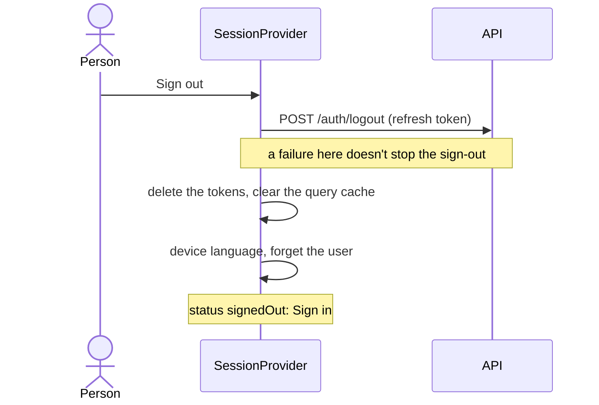

[Tasky mobile](../../README.md) › [Auth](README.md) › Sign out

# Sign out

Ends this device's session. Other devices stay signed in.

## Steps

1. **`POST /auth/logout`** with the saved refresh token, so the server ends this session. If it fails (offline), the app signs out locally anyway; the server session then ends when its refresh token expires.
2. **Delete the tokens** from secure storage.
3. **Clear the query cache.**
4. **Language** goes back to the device's; the current user is forgotten.
5. **Status `signedOut`.** Navigation swaps to Sign in; the signed-in screens and their history go away.

## Where it's offered

| Place | For now |
|---|---|
| Today | A **Sign out** link, until Settings exists |
| Can't reach Tasky | **Sign out**, to use another account while the API is unreachable ([Launch](launch.md#cant-reach-tasky)) |
| Settings (next) | Sign out, and the sessions list: sign out one device or all ([pending](../../../tasky-docs/design/pending-decisions.md#apps)) |

When the server ends the session instead (another device, password change, deactivation), the app does steps 2–5 on its own: see [Tokens › When the server ends the session](tokens.md#when-the-server-ends-the-session).

## Code

| Piece | Where |
|---|---|
| Sign out | `signOut()` in `src/shared/session/SessionProvider.tsx` |
| Endpoint | `identityApi.logout` in `src/data/identity/api.ts` |

---

← [Tokens and invalid tokens](tokens.md) · ↑ [Auth](README.md)
