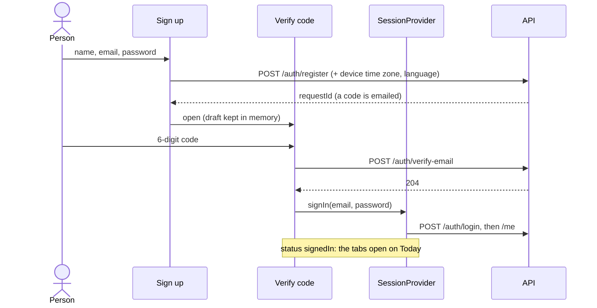

[Tasky mobile](../../README.md) › [Auth](README.md) › Sign up

# Sign up

Create an account, confirm the email with a 6-digit code, and land signed in.

## Contents

- [Steps](#steps)
- [Create your account](#create-your-account)
- [Check your email](#check-your-email)
- [Errors](#errors)
- [Code](#code)

## Steps

## Create your account

| Field | Rule | Checked |
|---|---|---|
| Your name | Required, up to 100 characters | When you leave the field |
| Email | A valid email, up to 254 characters | When you leave the field |
| Password | At least 8 characters | As you type: the rule under the field turns green |

- **Create account** stays disabled until all three are valid. The keyboard's Go on an incomplete form shows what's missing.
- The device's **time zone** and **language** are shown and sent with the form. They decide when "Today" starts and which language emails use.
- The notice explains invitations: sign up with the email an invitation went to, then accept it (a list or a team, [D57, D59](../../../tasky-docs/design/api/README.md#decision-log)). The Inbox is created on first need, not at sign-up for invited people.
- **`POST /auth/register`** answers the same way whether the email is new, waiting for its code, or already an account. An existing account gets an "already registered" email instead of a code, so the form can't be used to find out who has an account. The app always moves on to Check your email.
- The account gets its password only when the code is confirmed, and it's the password of the attempt that was confirmed.

## Check your email

- Six code boxes. The code is submitted when the last digit is typed, or with **Verify**.
- **`POST /auth/verify-email`** with the `requestId` and the code, then [sign in](sign-in.md) with the email and password from the form.
- Codes expire after 15 minutes. **Resend code** calls `POST /auth/resend-verification`, which returns a new `requestId`; the boxes clear and a notice confirms.
- The name, email, password and `requestId` stay in memory only (`signUpDraft`), never in navigation params or storage. After a reload they're gone, and the screen goes back to Sign up.
- If the code was accepted but signing in failed (for example, offline), **Verify** only retries the sign-in: the code is single-use.

## Errors

| Response | Where | The app |
|---|---|---|
| `400` with field errors (e.g. password rules) | Create your account | Under the field |
| `400 auth.invalid_code` | Check your email | Under the code: "The code is wrong or has expired…" |
| `503 auth.account_setup_pending` | Signing in right after verifying | Retried quietly; then the message |
| No response | Either step | "Can't reach Tasky…" |

## Code

| Piece | Where |
|---|---|
| Screens | `src/features/auth/SignUpScreen.tsx`, `VerifyCodeScreen.tsx` |
| Code boxes, resend | `src/features/auth/components/CodeStep.tsx`, `CodeInput.tsx` |
| Draft between the screens | `src/features/auth/signUpDraft.ts` |
| Rules and limits | `src/core/validation/rules.ts`, `limits.ts` (same as the API's) |
| Endpoints | `register`, `verifyEmail`, `resendVerification` in `src/data/identity/api.ts` |

---

← [Sign in](sign-in.md) · ↑ [Auth](README.md) · Next: [Password reset](password-reset.md) →
