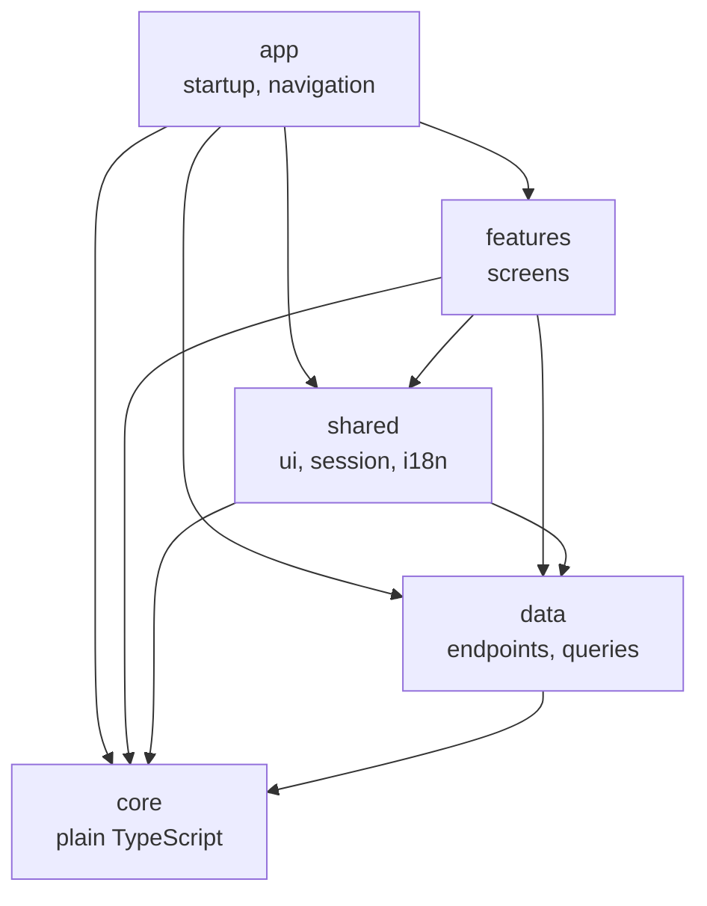

[Tasky mobile](../../README.md) › Structure

# Structure

How the code is organized: what each folder holds, what may import what, and where a new piece goes. The reasoning is in [06-mobile.md › Folder structure](../../../tasky-docs/design/clients/apps/06-mobile.md#folder-structure).

## Contents

- [The project](#the-project)
- [Layers](#layers)
- [Import rules](#import-rules)
- [Naming](#naming)
- [Adding a screen](#adding-a-screen)

## The project

```
tasky-mobile/
├── index.tsx              Registers src/app/App with Expo
├── app.json               Name, scheme "tasky", icons, splash, iOS and Android settings
├── app.config.ts          app.json + the active palette's colors (splash, Android icon)
├── eslint.config.js       Lint, the import rules and the no-hard-coded-colors rule
├── tsconfig.json          TypeScript strict; the @/ alias for src/
├── .env.example           EXPO_PUBLIC_API_URL, only to reach an API somewhere else
├── docs/                  This documentation
└── src/
    ├── app/               Startup and wiring                      → app.md
    ├── core/              Plain TypeScript: HTTP, tokens, dates…  → core.md
    ├── data/              One folder per API module               → data.md
    ├── features/          One folder per product area             → features.md
    ├── shared/            Design system, session, i18n            → shared.md
    └── assets/images/     App icon, splash
```

| Folder | Holds | Doc |
|---|---|---|
| `src/app` | Providers, navigation, the single HTTP client and token manager | [app.md](app.md) |
| `src/core` | The HTTP client, token handling, dates, validation rules. No React, no Expo | [core.md](core.md) |
| `src/data` | Endpoints, types, query keys and hooks, grouped like the API's modules | [data.md](data.md) |
| `src/features` | Screens, grouped by product area | [features.md](features.md) |
| `src/shared` | The design system (`ui`), session state, translations | [shared.md](shared.md) |

## Layers

Data is grouped **by API module**; screens **by product area** ([M1](../../../tasky-docs/design/clients/apps/06-mobile.md#decisions)). The API's Tasks module owns views, collections, tags, steps and search, so a `tasks` folder holding its screens would hold most of the app.



Arrows point to what a layer may import. Nothing points up: `core` knows nothing about React, and a screen never imports another feature.

## Import rules

Checked by ESLint (`import/no-restricted-paths` in `eslint.config.js`): a wrong import fails `npm run check`.

| From | May import | Never |
|---|---|---|
| `app` | anything | — |
| `features/x` | `data`, `shared`, `core` | Another feature: navigate to its screen by route name |
| `shared/ui` | `core` (types only) | `data`, `features`, `app`, `shared/session` |
| `shared` (other) | `data`, `shared/ui`, `core` | `features`, `app` |
| `data/x` | `core`, types from other `data/*` | React components, `shared`, `features`, `app` |
| `core` | nothing outside `core` | React, React Native, Expo |

`core` stays free of React so it can move into the shared packages when the desktop app starts ([M4](../../../tasky-docs/design/clients/apps/06-mobile.md#decisions)).

Colors are also checked: a hex or `rgb()` literal anywhere in `src/` outside `shared/ui/palettes/` fails lint.

## Naming

| What | Rule | Example |
|---|---|---|
| Components, screens | `PascalCase.tsx` | `SignInScreen.tsx`, `TextField.tsx` |
| Everything else | `camelCase.ts` | `tokens.ts`, `signUpDraft.ts` |
| Hooks | `use…` | `useEmailField.ts`, `useCurrentWorkspace.ts` |
| Screens | `…Screen`; sheets `…Sheet` | `TodayScreen`, `QuickAddSheet` |
| Imports across folders | The `@/` alias | `import { Button } from '@/shared/ui'` |
| Imports inside a folder | Relative | `import { resetDraft } from './resetDraft'` |

No `index.ts` barrels inside features; `shared/ui` has one, so screens import the design system from one place.

## Adding a screen

1. **Endpoints and types** in `src/data/<api module>/` (`api.ts`, `types.ts`), then its query or mutation hook.
2. **The screen** in `src/features/<area>/`, built from `shared/ui` and `shared/components`.
3. **Its route** in `src/app/navigation/RootNavigator.tsx`, in the right group.
4. **Strings** in `src/shared/i18n/en.json` and `es.json`.
5. **Only what the API allows:** hide actions the user's role can't take ([roles and permissions](../../../tasky-api/docs/roles-and-permissions.md)).
6. `npm run check`.
